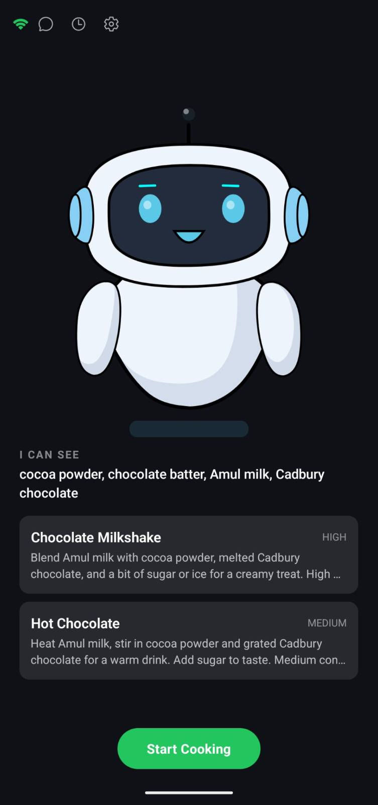
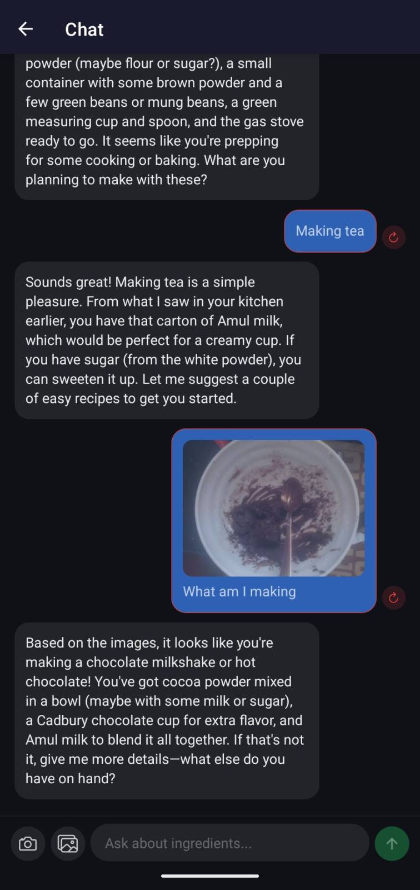

# Cookie Project

A mobile cooking assistant application with an interactive character system to guide users live through cooking, supported by a backend server.

## Server

The server can be run using `uv run cookie-server`.

## Mobile Application

To host the mobile application locally and connect it to the server:

1. Ensure your mobile device and the server are on the same network.
2. Update the `.env.local` file in the `mobile/` directory with the local IP address of your machine where the server is running.
   Alternatively, you can handle the server address configuration within the mobile application's settings.

## Character System (Mobile)

The `mobile/src/characters/CHARACTERS.md` document provides a detailed guide on how to design, extract, and wire up new characters, and how to build alternative renderers for the mobile application. It covers:

- Architecture Overview
- Schema definition and generation from Inkscape SVG
- Inkscape authoring rules and naming conventions
- Expression types (transform and overlay) and their mapping
- Steps for adding new characters and renderers
- Protocol reference for expression names and normalized values
- Common mistakes and troubleshooting tips

## Screenshots

| Bot Screen | Chat Screen |
|:---:|:---:|
|  |  |
